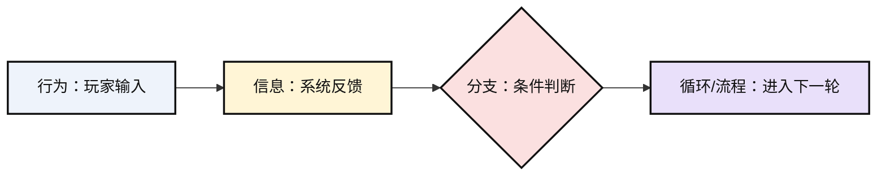
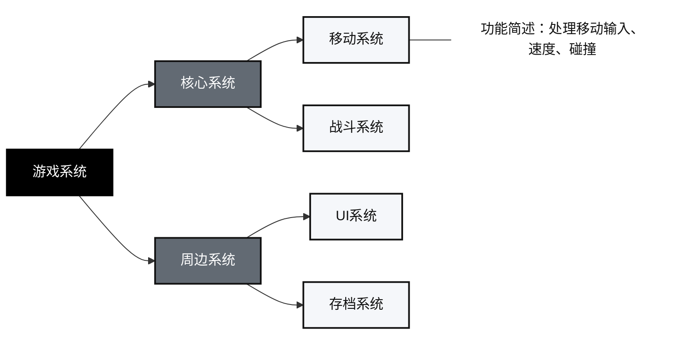

# 游戏设计技能说明

## 技能定位

`gamedesign` 是一个面向游戏设计与游戏原型设计的 Codex 技能。它要求 Codex 以游戏设计师或游戏制作人的视角工作，优先使用随技能绑定的 `references/game-design.pdf` 作为知识库，使用 `references/game-design-document-template.pdf` 作为游戏策划案模板引用，并使用 `references/worldview-design-template.pdf` 作为世界观设计模板引用。

该技能采用 MCP 优先、脚本兜底的执行方式。MCP 负责外部能力调用，skill 负责设计规则、知识库优先级和输出规范。

适用任务包括：

- 解释知识库中的游戏设计概念。
- 自主设计游戏方案，并补齐用户没有说明的设计决策。
- 整理用户零散创意，并按“核心体验、核心玩法、核心系统、核心循环”以及“其他体验、其他玩法、其他系统”规范化为可执行方案。
- 检阅用户的设计思路，指出问题并提出修改建议。
- 设计或评估核心体验、核心玩法、核心系统、核心循环。
- 生成游戏循环时，使用符合指定图例的流程图。
- 生成游戏系统时，使用“游戏系统 -> 核心系统/周边系统 -> 具体系统”的结构图。
- 生成游戏交互链时，使用“目的、操作、障碍、且、或、知识、奖励、决策信息”的图例。
- 生成游戏策划案时，将流程图、系统图、交互链和思维导图渲染为图片文件。
- 生成游戏策划案时，默认输出 Markdown `.md` 文件。
- 生成游戏策划案。
- 严格按世界观模板生成世界观设计，并生成美术设定图、视觉参考图。
- 设计玩法原型、验证方案、系统规则、玩家反馈；制作原型时默认优先使用 Unity。
- 优先使用 MCP 完成知识库检索、网页研究、图示渲染、图像生成、Unity 工程检查和文档资产管理。
- 在知识库基础上结合网页资料补充市场案例、竞品参考、平台信息。

## 文件结构

```text
gamedesign/
├── SKILL.md
├── README.md
├── agents/
│   └── openai.yaml
├── references/
│   ├── game-design.pdf
│   ├── game-design-document-template.pdf
│   └── worldview-design-template.pdf
└── scripts/
    └── search_knowledge_base.py
```

## 知识库规则

技能会优先引用 `references/game-design.pdf`。当任务涉及核心体验、核心玩法、核心系统、核心循环时，必须且只能使用知识库中的相关定义，不能从常识、记忆或网页资料补充定义。

技能不得参考用户记忆、跨会话记忆、推断出的个人偏好或未在当前任务中出现的历史信息。只能使用当前对话、用户本轮提供的文件、技能内置引用文件、与当前任务明确相关的本地项目文件，以及带来源的网页资料。如果某个信息只来自记忆而不是当前上下文，应忽略它，或请用户重新提供。

## MCP 使用规则

当存在相关 MCP 工具时，必须优先使用 MCP；没有对应 MCP 时，才使用技能自带脚本或本地文件流程。MCP 输出不能覆盖知识库中关于 `核心体验`、`核心玩法`、`核心系统`、`核心循环` 的定义。

建议接入的 MCP 能力：

- `knowledge_search`：检索三份 PDF，返回原文片段、页码、模板章节。
- `diagram_render`：把游戏循环、系统图、交互链、思维导图渲染为 SVG/PNG。
- `image_generation`：根据世界观模板内容生成美术设定图、视觉参考图。
- `unity_project`：读取 Unity 场景、Prefab、脚本、输入映射、资源和项目设置。
- `document_artifact`：创建 Markdown 策划案，管理图片资源和导出格式。
- `web_research`：搜索竞品、市场、平台资料，并返回来源。

兜底工具：

- 知识库检索：`scripts/search_knowledge_base.py`
- Mermaid 图渲染：`scripts/render_mermaid_diagrams.py`
- 无外部依赖 SVG 生成：`scripts/create_diagram_svg.py`
- 可选 PDF 导出：`scripts/create_design_pdf.py`

当生成游戏策划案时，必须优先读取 `references/game-design-document-template.pdf`，先定位其中的模板结构，再严格按照模板结构输出。如果主知识库中也存在策划案模板，除非用户另有要求，否则以独立模板 PDF 为准。

当生成世界观设计时，必须优先读取 `references/worldview-design-template.pdf`，先定位其中的模板结构，再严格按照模板结构输出。如果主知识库中也存在世界观模板，除非用户另有要求，否则以独立模板 PDF 为准。不得遗漏、改名、合并或重排模板章节，除非用户明确要求只做局部草案。

当生成世界观设计时，图像生成是必做项，不是可选项。完成世界观模板正文后，必须调用 `image2`、MCP `image_generation` 或当前可用的图像生成工具，生成真实图片资产，不能只写提示词。除非用户要求减少数量，否则至少生成 4 张图：

- `美术设定图：主场景`
- `美术设定图：角色阵营/角色`
- `视觉参考图：色彩与材质`
- `视觉参考图：建筑/服饰语言`

图像提示词必须来自已经完成的世界观模板内容，不能来自用户记忆或未被当前上下文支持的假设。输出的 Markdown 中必须引用这些图像、写明标题，并列出图片文件路径。如果没有可用图像生成工具，必须明确标记世界观任务未完成并说明图像生成被阻塞，不能把缺图版本当成最终交付。

网页资料只能用于补充当前市场信息、竞品案例、平台约束、发行环境等外部背景，不能覆盖知识库内容。

拆解或应用“核心体验、核心玩法、核心系统、核心循环、其他体验、其他玩法、其他系统”时，应优先保留知识库中的术语原词。例如知识库中出现“动作体验”“动作挑战”“计算挑战”“逻辑挑战”“冒险体验”“平台跳跃”“自动化”“攻击操控”“形态切换”“资源消耗”“游泳操控”“附加系统”等分类时，回答应先写出这些原词，再说明它们如何映射到具体游戏。不要用“掌控感”“隐藏发现”“道具成长”等自造概括替代知识库术语，除非知识库或用户原文明确使用了该词。

技能不应一味顺从用户的设计思路。用户提供点子时，技能应从目标体验、核心玩法、核心循环、系统支撑、受众、制作成本、原型验证这些角度审视设计；保留成立的部分，指出矛盾和风险，并给出可执行的替代方案。

用户提供零散创意时，技能应先归纳玩家幻想、玩家动作、限制条件、题材、平台、单局时长、制作边界，再按照知识库中的“核心体验、核心玩法、核心系统、核心循环”定义把创意收束为一个可执行版本。同时要整理“其他体验、其他玩法、其他系统”，并优先使用知识库原词；这些内容必须服务核心内容，不能替代核心内容。无法支撑核心结构或明确支撑作用的想法应标注为暂缓、删减或改写。

制作原型时默认优先使用 Unity。除非用户指定其他引擎，或任务明显更适合纸面、表格、网页、桌游或无代码验证，否则应把原型拆成 Unity 场景、C# 脚本/组件、Prefab、ScriptableObject、输入映射、UI Canvas、测试场景和验收标准。

生成游戏循环时，必须使用流程图，并严格遵守图例：

- `行为`：玩家主动执行操作后产生的游戏行为，使用浅蓝节点。
- `信息`：由游戏提供、玩家被动接收的更新信息，使用浅黄节点。
- `分支`：根据当前情况不同，流程走向不同分支，使用浅红/粉节点。
- `循环/流程`：接下来进入下一级游戏循环或流程，使用浅紫节点；该次级流程的内部情况可以另表。

默认使用 Mermaid，并定义 `action`、`info`、`branch`、`loop` 四个 class：



不要把系统反馈写成 `行为`，不要把多结果判断写成 `信息`。节点文字应短，能直接放进图形框。

生成游戏系统时，必须使用系统结构图，并严格遵守图例：

- 根节点为 `游戏系统`。
- 第一层分为 `核心系统` 和 `周边系统`。
- 第二层列出具体系统，例如 `移动系统`、`战斗系统`、`资源系统`、`关卡系统`、`UI系统`。
- 如需说明，在具体系统右侧添加 `功能简述`。

默认使用 Mermaid。不要把玩家行为写进系统结构图；玩家行为应放在游戏循环流程图中。



生成游戏交互链时，必须使用交互链图，并严格遵守图例：

- `目的`：玩家目标或阶段目标，使用红色节点。
- `操作`：玩家执行操作或学习操作，使用蓝色节点。
- `障碍`：玩家解决或遭遇的障碍，使用橙色节点。
- `且`：两个条件或要求同时成立，使用白色节点。
- `或`：可替代路径或可替代条件，使用深灰节点。
- `知识`：玩家在操作中积累的知识，使用浅紫节点。
- `奖励`：玩家达成目标或越过障碍后获得的奖励，使用浅绿节点。
- `决策信息`：玩家做决策所需的信息，使用浅黄节点。

默认使用 Mermaid。交互链应展示从 `目的` 到 `操作` 再到 `障碍` 的最小可读路径；只有当 `知识`、`奖励`、`决策信息` 会影响后续判断或行动时才加入。`且`/`或` 用来表达逻辑关系，不要用含混文字替代。


交互链图不能替代游戏循环流程图或游戏系统结构图。交互链负责解释玩家目标、操作、障碍、知识、奖励和决策信息如何在体验层连接。

生成游戏策划案时，文档中的流程图、系统图、交互链和思维导图必须生成图片文件。不要只在正文里保留 Mermaid 源码。建议把图源和图片放在任务目录下：

```text
artifacts/diagrams/
├── core-loop.mmd
├── core-loop.svg
├── system-map.mmd
├── system-map.svg
├── interaction-chain.mmd
└── interaction-chain.svg
```

优先使用 SVG，方便保留清晰文字；如果目标文档或用户工作流需要位图，再额外导出 PNG。可使用技能脚本渲染：

```bash
python3 scripts/render_mermaid_diagrams.py artifacts/diagrams
python3 scripts/render_mermaid_diagrams.py artifacts/diagrams --png
```

如果当前环境没有 Mermaid CLI，可以使用无外部依赖的 SVG 生成脚本：

```bash
python3 scripts/create_diagram_svg.py artifacts/diagrams/core-loop.json artifacts/diagrams/core-loop.svg
```

生成游戏策划案时，最终交付物默认是 Markdown `.md` 文件。图示应以 Markdown 图片语法引用独立图片文件，例如：

```markdown

```

只有当用户明确要求 PDF 时，才额外导出 PDF：

```bash
python3 scripts/create_design_pdf.py artifacts/game-design-document.md artifacts/game-design-document.pdf
```

## 检索知识库

可以在技能目录中运行：

```bash
python3 scripts/search_knowledge_base.py "核心体验" "核心玩法" "核心循环"
python3 scripts/search_knowledge_base.py --source game-design-document-template "游戏策划案" "游戏企划"
python3 scripts/search_knowledge_base.py --source worldview-design-template "世界观" "模板"
```

生成策划案图像资源时可运行：

```bash
python3 scripts/render_mermaid_diagrams.py artifacts/diagrams
python3 scripts/create_diagram_svg.py artifacts/diagrams/core-loop.json artifacts/diagrams/core-loop.svg
```

常用关键词：

- `核心体验`
- `核心玩法`
- `核心系统`
- `核心循环`
- `其他体验`
- `其他玩法`
- `其他系统`
- `动作体验`
- `动作挑战`
- `计算挑战`
- `逻辑挑战`
- `冒险体验`
- `平台跳跃`
- `自动化`
- `攻击操控`
- `形态切换`
- `资源消耗`
- `游泳操控`
- `附加系统`
- `游戏策划案`
- `策划案模板`
- `世界观设计`
- `原型`
- `验证`

如果脚本提示缺少 PDF 解析工具，可以安装 `pypdf` 或 `PyPDF2`，也可以把 PDF 提取出的文本保存为：

```text
references/game-design.txt
references/game-design-document-template.txt
references/worldview-design-template.txt
```

脚本会优先读取这个文本缓存。

## 输出要求

技能要求输出具体、可执行、可验证的设计内容。回答中应尽量描述：

- 玩家执行的动作。
- 系统如何响应。
- 玩家获得的反馈。
- 资源、风险或约束。
- 成功与失败条件。
- 原型验证方式。

评审用户设计时应输出：

- 应保留的设计点。
- 设计矛盾或缺口。
- 修改建议。
- 制作成本、内容量、学习成本、可测试性方面的取舍。
- 下一步原型验证任务。

整理零散创意时建议输出：

```text
## 原始创意归纳
保留信息：...
缺失信息：...
设计假设：...

## 核心体验
知识库术语：...
规范化表达：...

## 核心玩法
知识库定义：...
规范化表达：...

## 核心系统
知识库定义：...
系统结构图：...
系统边界：...

## 核心循环
知识库定义：...
循环流程图：...
循环说明：...

## 其他体验
知识库术语：...
规范化表达：...
保留/删减/暂缓：...

## 其他玩法
知识库术语：...
规范化表达：...
保留/删减/暂缓：...

## 其他系统
知识库定义/术语：...
规范化表达：...
保留/删减/暂缓：...

## 原型验证
Unity 场景：...
核心组件：...
验收标准：...
```

Unity 原型方案应写清：

- Unity 版本或版本假设。
- 场景列表和每个场景验证的目标。
- 玩家控制、镜头、交互、敌人/物件、资源、UI、反馈组件。
- 可调参数或数据对象。
- 临时代用美术/音频。
- 可测的通过/失败标准。

技能禁止使用空泛表达作为设计结论，例如：

```text
有趣、好玩、丰富、多样、沉浸、爽感、节奏感、可玩性、策略性、代入感、深度、创新、优化、提升、完善、增强、合理、适当、若干、等等、之类、相关、某些、一些
```

如果这些词来自用户原文或知识库引用，可以保留；否则应替换为明确的规则、行为、反馈、数值或验收标准。

拆解游戏时建议使用：

```text
## 核心体验
知识库术语：...
对象映射：...

## 核心玩法
知识库定义：...
对象映射：...

## 核心循环
知识库定义：...
循环流程图：...
循环说明：...

## 核心系统
知识库定义：...
系统结构图：...
系统拆解：...

## 其他体验
知识库术语：...
对象映射：...
与核心体验的关系：...

## 其他玩法
知识库术语：...
对象映射：...
与核心玩法的关系：...

## 其他系统
知识库定义/术语：...
对象映射：...
与核心系统/核心循环的关系：...
```

## 使用示例

```text
Use $gamedesign 根据知识库解释“核心循环”，并用一个肉鸽卡牌游戏例子说明。
```

```text
Use $gamedesign 为一个 10 分钟试玩版设计核心玩法和原型验证方案。
```

```text
Use $gamedesign 按知识库中的游戏策划案模板，为一款双人合作解谜游戏生成策划案。
```

```text
Use $gamedesign 按知识库中的世界观设计模板，为一款末日海上城市游戏生成世界观设计。
```
