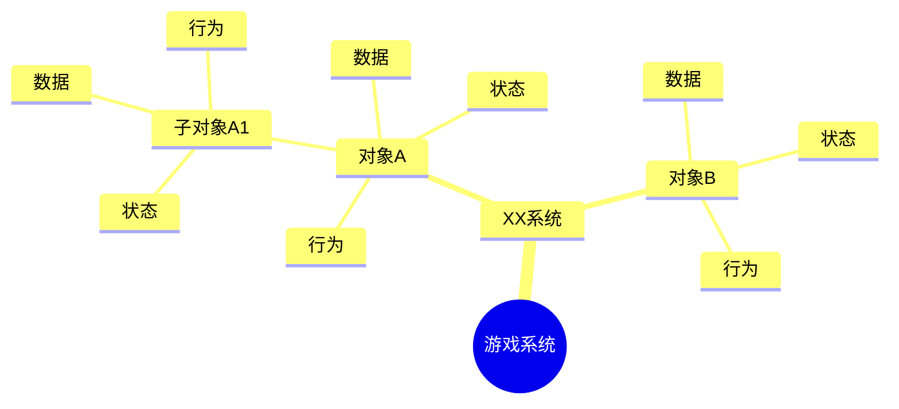

# System Spec Template

Use this template to produce a programmer-facing game system策划案. Keep headings in Chinese unless the user asks otherwise.

## 1. 输入整理

- `原始材料`: summarize the user's notes, loop diagram, feature list, or screenshot in implementation-relevant terms.
- `目标系统`: name the concrete system or systems being specified.
- `设计边界`: list in-scope mechanics and deferred ideas.
- `关键假设`: list only assumptions that affect implementation.

## 2. 系统总览

Write a short purpose statement:

```text
本系统负责 <runtime responsibility>，使玩家能够 <player action/result>，并向 <other systems/UI/save/audio/etc.> 输出 <events/data/feedback>。
```

Then list:

| 项目 | 内容 |
| --- | --- |
| 系统名称 |  |
| 玩家目标 |  |
| 核心输入 |  |
| 核心输出 |  |
| 依赖系统 |  |
| 被依赖系统 |  |
| 主要风险 |  |

## 3. 系统对象树

Represent the structure shown by the user's reference image. Use concrete object names.

```text
游戏系统
└── XX系统
    ├── 对象A
    │   ├── 数据
    │   ├── 状态
    │   ├── 行为
    │   └── 子对象A1
    │       ├── 数据
    │       ├── 状态
    │       └── 行为
    └── 对象B
        ├── 数据
        ├── 状态
        ├── 行为
        └── 子对象B1
```

If Mermaid is useful, also provide a diagram:



## 4. 对象规格

Repeat this section for every object and child object.

### 4.x 对象名

`职责`: one sentence describing what the object owns at runtime.

`生命周期`: created by whom, when it becomes active, when it is disabled or destroyed, and whether it persists across scenes/sessions.

#### 数据

| 字段 | 类型 | 来源/归属 | 默认值/范围 | 读写时机 | 是否持久化 | 说明 |
| --- | --- | --- | --- | --- | --- | --- |
|  |  | 配置/运行时/存档/UI输入 |  |  | 是/否 |  |

Guidelines:

- Static balance, definitions, costs, rewards, thresholds, and level tables are configuration data.
- Current HP, cooldown remaining, selected target, combo count, and temporary flags are runtime data.
- Save data should be listed separately when it survives a run, level, or app restart.

#### 状态

| 状态 | 进入条件 | 退出条件 | 可转移到 | 进入副作用 | 禁止转移/异常 |
| --- | --- | --- | --- | --- | --- |
|  |  |  |  |  |  |

Guidelines:

- State is a named runtime mode, not just a number.
- Include idle, unavailable, resolving, completed, failed, stunned, cooling down, selected, dragging, equipped, locked, unlocked, or other concrete modes only when they affect behavior.

#### 行为

| 行为 | 触发源 | 输入 | 前置条件 | 处理过程 | 输出/事件 | 反馈 | 失败处理 | 验收检查 |
| --- | --- | --- | --- | --- | --- | --- | --- | --- |
|  | 玩家输入/计时器/碰撞/UI/其他系统 |  |  |  |  |  |  |  |

Guidelines:

- A behavior must be testable: it should name an observable result.
- When behavior changes state, name the source and target states.
- When behavior modifies data, name the fields.
- When behavior contacts another system, name the event, call, or data contract.

#### 子对象

| 子对象 | 父对象关系 | 拥有的数据 | 拥有的状态 | 拥有的行为 | 生命周期 | 通信方式 |
| --- | --- | --- | --- | --- | --- | --- |
|  |  |  |  |  |  |  |

## 5. 系统规则与流程

Use this section for rules that cross multiple objects.

| 规则 | 涉及对象 | 条件 | 结果 | 优先级/冲突处理 | 验收检查 |
| --- | --- | --- | --- | --- | --- |
|  |  |  |  |  |  |

If the user supplied a game loop diagram, map it into implementation steps:

| 循环步骤 | 玩家/系统动作 | 读数据 | 写数据 | 状态变化 | 触发事件 | 反馈 |
| --- | --- | --- | --- | --- | --- | --- |
|  |  |  |  |  |  |  |

## 6. 事件与接口

| 名称 | 类型 | 发送者 | 接收者 | 参数 | 触发时机 | 失败/幂等规则 |
| --- | --- | --- | --- | --- | --- | --- |
|  | Event/Command/Query/Callback |  |  |  |  |  |

## 7. 推荐设计模式

Use this section to connect system-planning decisions to implementation structure. Read `design-patterns-unity.md` when needed.

| 适用问题 | 推荐模式 | 应用对象/文件 | 选择理由 | 不使用时的风险 | 验收检查 |
| --- | --- | --- | --- | --- | --- |
|  | Singleton/Factory/Abstract Factory/Builder/Prototype/Object Pool/Facade/Decorator/Adapter/Observer/State/Strategy/Command/Publish-Subscribe |  |  |  |  |

Guidelines:

- Recommend only patterns that solve a visible pressure in this system.
- Prefer `Observer` or `Publish-Subscribe` for UI, task, audio, VFX, and save notifications.
- Prefer `State` for objects whose behavior changes by named runtime mode.
- Prefer `Strategy` for replaceable algorithms such as attack modes, AI policies, targeting, reward calculation, or sorting rules.
- Prefer `Factory`, `Abstract Factory`, `Builder`, or `Prototype` when object creation is complex, data-driven, themed, or prefab-based.
- Prefer `Object Pool` when objects are spawned and destroyed frequently, such as bullets, hit effects, floating text, enemies, or projectiles.
- Prefer `Facade` when one high-level gameplay operation coordinates several subsystems.
- Prefer `Adapter` when old and new interfaces must coexist.
- Prefer `Decorator` when temporary or stackable modifiers add behavior without changing the base object.
- Prefer `Command` when actions need recording, replay, cancellation, undo, or editor tooling.

## 8. Unity 实现参考

Use this section even when no Unity project is present; keep it as a plan unless code changes are requested.

| Unity对象/文件 | 类型 | 责任 | 设计师可调数据 | 验收检查 |
| --- | --- | --- | --- | --- |
|  | Scene/Prefab/MonoBehaviour/ScriptableObject/UI/Input/Audio/VFX |  |  |  |

Recommended mapping:

- System-level rules: service/controller MonoBehaviour or plain C# domain class.
- Static config: ScriptableObject or table asset.
- Runtime state: scene object, component field, runtime model, or save data class.
- Object behavior: narrow MonoBehaviour or plain C# class with explicit owner.
- Cross-system communication: typed event, command method, interface, or existing project event bus.

## 9. 边界情况

| 情况 | 预期处理 | 可见反馈 | 测试方式 |
| --- | --- | --- | --- |
|  |  |  |  |

## 10. 待确认问题

Only list questions that block implementation. For each question, state the default assumption to use until the user answers.

| 问题 | 影响 | 默认假设 |
| --- | --- | --- |
|  |  |  |
